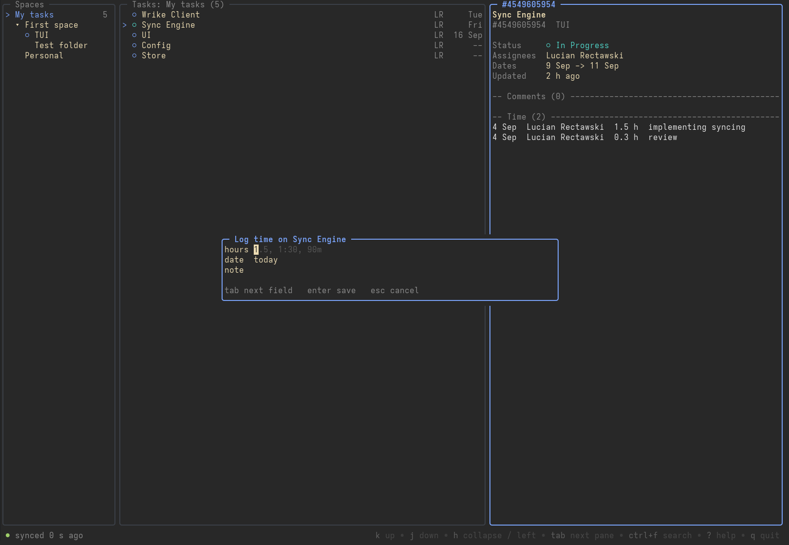
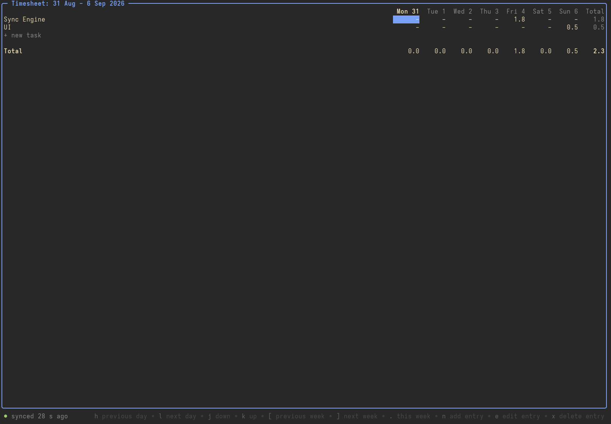

# Wrikery

An unofficial terminal client for Wrike.
Browse tasks, read descriptions, add comments, change statuses, log time and check your timesheet without leaving the terminal.
It keeps a local copy of what you follow, so browsing and search are instant and reading works offline.

The current version is v0.1.0, the first release.

## Screenshots

## Install

Download the archive for your system from the [releases page](https://github.com/mrcne/wrikery/releases), `wrikery_<version>_<os>_<arch>.tar.gz` for Linux and macOS on amd64 and arm64, with `checksums.txt` next to them.
Unpack it and put the `wrikery` binary on your PATH.

With Go 1.26 or newer installed, `go install github.com/mrcne/wrikery/cmd/wrikery@latest` builds it from source instead.

## First run

`wrikery` asks for a Wrike API token, a permanent access token created in the API section of your Wrike account, and keeps it in the system keychain.
Accounts hosted in the EU data center are detected automatically.
Then pick the spaces and projects to follow from a checklist and watch the first sync run.
`wrikery --demo` runs on built in sample data instead, with no token and no network, to look around first.

## Features

- browse the spaces, projects and folders you follow
- task list and task detail: description, status, assignee, dates, comments
- instant full text search over everything cached
- a timesheet view of your own logged time
- add comments
- change task status, assignee and dates
- log, edit and delete your own time entries
- offline: reads come from the local cache, writes are queued and sent later, and a sync issues screen lists any that failed for a retry or a discard

## Keys

| key | action |
| --- | --- |
| `j` `k` | move |
| `enter` | open |
| `/` | filter the list |
| `ctrl+f` | search |
| `c` | comment |
| `s` | status |
| `t` | log time |
| `T` | timesheet |
| `?` | every key for the current screen |
| `q` | quit |

## Config

The config file is `~/.config/wrikery/config.toml`, `--config PATH` reads another one.
`poll_interval` sets how often the app checks Wrike for changes and `log_level` how much it logs.
The `[ui]` table holds `theme` (auto, dark or light), `accent` for the highlight color, `ascii` for plain drawing characters, and `branch_template` for the branch name `Y` copies.
`host` names the Wrike data center, for example `app-eu.wrike.com`, when the automatic detection is not wanted.

## Docs

The product description is in [docs/overview.md](docs/overview.md), the technical design in [docs/architecture.md](docs/architecture.md), and technology decisions in [docs/adr/](docs/adr/).
A few requests for checking a token and the API by hand live in `tools/wrike-requests/wrike.http`.
See [CONTRIBUTING.md](CONTRIBUTING.md) before opening a pull request.
