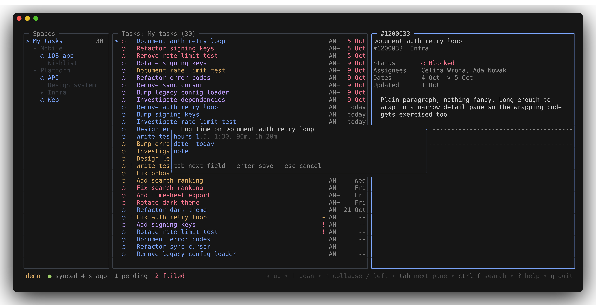
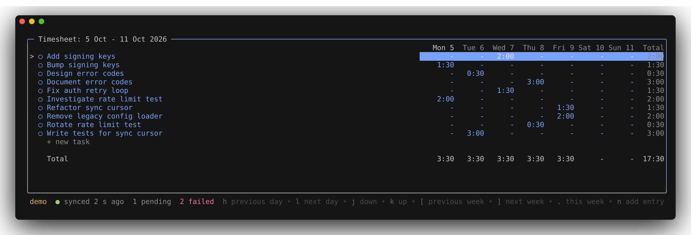

# Wrikery

An unofficial terminal client for Wrike.
Browse tasks, read descriptions, add comments, change statuses, log time and check your timesheet without leaving the terminal.
It keeps a local copy of what you follow, so browsing and search are instant and reading works offline.

## Status

The current version is v0.1.0, the first release.

## Screenshots





## Install

With Homebrew: `brew install mrcne/tap/wrikery`.

Or download the archive for your system from the [releases page](https://github.com/mrcne/wrikery/releases), `wrikery_<version>_<os>_<arch>.tar.gz` for Linux and macOS on amd64 and arm64, for example `wrikery_0.1.0_darwin_arm64.tar.gz`, with `checksums.txt` next to them.
Unpack it and put the `wrikery` binary on your PATH.

With Go 1.26 or newer installed, `go install github.com/mrcne/wrikery/cmd/wrikery@latest` builds it from source instead.

## First run

`wrikery` asks for a Wrike API token, a permanent access token created in the Wrike App Console with Get token, and keeps it in the system keychain.
Accounts hosted in the EU data center are detected automatically.
Then pick the spaces and projects to follow from a checklist and watch the first sync run.
`wrikery --demo` runs on built in sample data instead, with no token and no network, to look around first.

## Features

- browse the spaces, projects and folders you follow
- task list and task detail: description, status, assignee, dates, comments
- instant full text search over everything cached
- a timesheet view of your own logged time
- a board over workflow statuses, plain or with a lane per person or per folder
- create tasks
- add comments
- change task title, description, importance, status, assignee and dates
- move a task between folders, or put it in several
- log, edit and delete your own time entries
- commands for scripts and agents: list, show, move and create tasks from a shell, with JSON output
- offline: reads come from the local cache, writes are queued and sent later, and a sync issues screen lists any that failed for a retry or a discard

## Keys

| key | action |
| --- | --- |
| `j` `k` | move |
| `enter` | open |
| `/` | filter the list |
| `ctrl+f` | search |
| `c` | comment |
| `s` | status |
| `e` | edit the title |
| `E` | edit the description in `$EDITOR` |
| `p` | importance |
| `m` | move, or add to folders |
| `n` | new task |
| `t` | log time |
| `T` | timesheet |
| `?` | every key for the current screen |
| `q` | quit |

## Commands

`wrikery` alone opens the interface.
With a command it runs one operation on the same local cache and exits.

```sh
wrikery sync                                 # one sync cycle, --full also checks for deleted tasks
wrikery task list --folder "4 Later"         # tasks of a folder, project or space
wrikery task list                            # your own open tasks
wrikery task show "licence file"             # one task with its description and comments
wrikery task show "https://app-eu.wrike.com/open.htm?id=4552825748"
wrikery task status MAAAAAEPXpuT "In Progress"
wrikery task create --folder Sandbox Try the new command
```

A task or a folder is an id or a part of its title that matches exactly one cached row.
A task may also be the number or the link from the browser, the link goes in quotes.
Every command takes `--json`.
A write is sent right away and reported as sent, queued when Wrike could not be reached, rejected, or blocked when Wrike refused the token, which leaves the change queued and exits with 1.
Exit codes: 0 done, 1 error, 2 usage, 3 queued but not on Wrike yet.

## Config

The config file is `~/.config/wrikery/config.toml`, `--config PATH` reads another one.
`poll_interval` sets how often the app checks Wrike for changes and `log_level` how much it logs.
The `[ui]` table holds `theme` (auto, dark or light), `accent` for the highlight color, `ascii` for plain drawing characters, and `branch_template` for the branch name `Y` copies.
`host` names the Wrike data center, for example `app-eu.wrike.com`, when the automatic detection is not wanted.

## Docs

The product description is in [docs/overview.md](docs/overview.md), the technical design in [docs/architecture.md](docs/architecture.md), and technology decisions in [docs/adr/](docs/adr/).
A few requests for checking a token and the API by hand live in `tools/wrike-requests/wrike.http`.
See [CONTRIBUTING.md](CONTRIBUTING.md) before opening a pull request.

## License

Mozilla Public License 2.0, see [LICENSE](LICENSE).
Changes to these files have to stay under this license when they are distributed.
A larger program that includes them may use other terms.

Wrike is a trademark of Wrike, Inc.
This project is not affiliated with or endorsed by Wrike.
